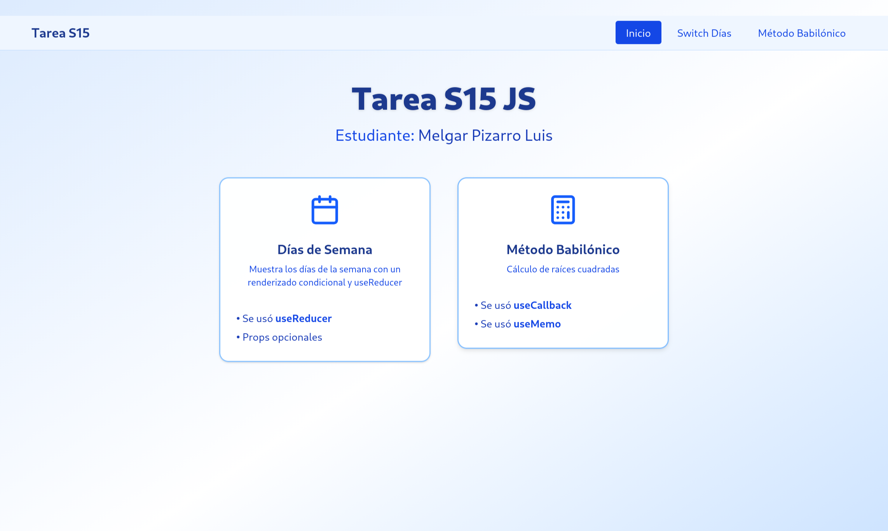

# Tarea S15 JS

## Características

### 1. Componente Switch Días de Semana

- Renderizado condicional usando `useReducer`
- Selector de días de la semana
- Mensajes personalizados para cada día
- Props opcionales para configurar el día inicial

### 2. Componente Método Babilónico

- Implementación del método babilónico para calcular raíces cuadradas
- Uso de `useCallback` para optimización de funciones
- Uso de `useMemo` para cálculos derivados
- Visualización de pasos intermedios del cálculo
- Lista renderizada de iteraciones

## Tecnologías Utilizadas

- React 19
- React Router DOM para navegación
- TypeScript
- Tailwind CSS para estilos
- Next.js 15

## Instalación

1. Clonar el repositorio

```bash
git clone https://github.com/Luis-Fernando-MP/tarea-s15-js.git
```

2. Instalar dependencias

```bash
npm install
```

3. Iniciar la aplicación

```bash
npm run dev
```

Estructura de carpetas

```bash
app/
├── components/
│   ├── SwitchDias.tsx     # Componente de días de la semana
│   ├── metodo-babilonico.tsx  # Componente del método babilónico
│   ├── home.tsx           # Página principal
│   └── Navbar.tsx         # Barra de navegación
├── root.tsx               # Configuración de rutas
└── layout.tsx             # Layout principal
```
